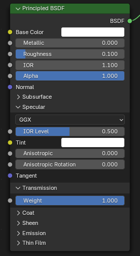
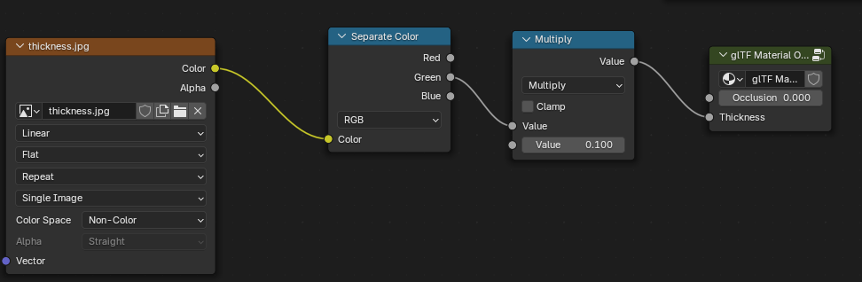

# BABYLON REFRACTION 

## HOW TO RUN 

```python
>> cd your_www_folder
>> python -m http.server 
``` 

`In your browser : 127.0.0.1:8080`

## TRANSPARENCY IN BLENDER

> Those are the settings needed to activate refraction on your material.

 - Roughness = 0.1
 - IOR > 1.0
 - Alpha = 1.0
 - Transmission > Weight = 1.0



## BLENDER NOTE FOR EXPOSING VALUES TO BABYLON MATERIAL

> You need to add thoses nodes in your blender file to expose IOR on Babylon material inspector.

